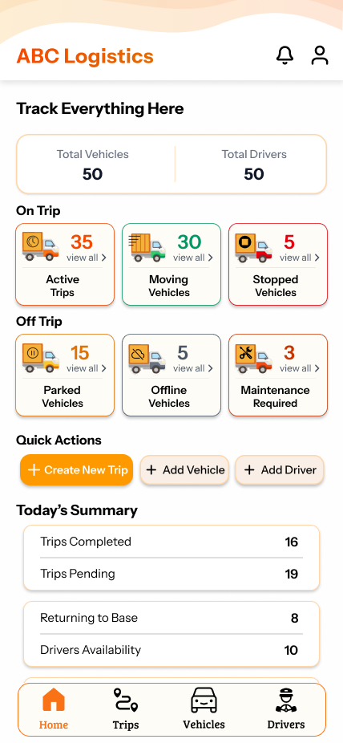

# 🚚 Logistics App UI/UX Design

A complete **Logistics Application UI/UX Design** created in **Figma**, focused on modern, clean, and user-friendly screens for logistics, delivery, tracking, and transport management.

This project also includes a useful **Figma Assets Pack** for designers, containing reusable UI elements, icons, components, and design resources.

---

## 🎨 Project Overview

This Figma design mainly focuses on a **Logistics Application** that helps users manage and track logistics-related activities in a simple and efficient way.

The design includes clean layouts, modern UI components, and a professional visual style suitable for logistics, courier, delivery, transport, and supply chain applications.

---

## 🔗 Figma Design Links

### Main Logistics App Design
[View Figma Design](https://www.figma.com/design/rqEFQJ54I4QZ7xXC9Gu1BB/Designs?node-id=0-1&t=2f3k9ziRq8nnkYqi-1)

### Figma Assets Pack
[View Assets Pack](https://www.figma.com/design/rqEFQJ54I4QZ7xXC9Gu1BB/Designs?node-id=2-7857&t=2f3k9ziRq8nnkYqi-1)

---

## 📱 Design Focus

- Logistics application UI
- Delivery tracking screens
- Clean dashboard layouts
- User-friendly navigation
- Mobile-first design approach
- Reusable UI components
- Modern and minimal interface
- Designer-friendly assets pack

---

## 🧩 What’s Included

- Mobile app screens
- Logistics dashboard concepts
- Tracking and delivery flow
- Reusable Figma components
- Icons and UI assets
- Color styles
- Typography styles
- General design assets for Figma designers

---

## 🖼️ Preview

Add your design screenshots inside an `assets` or `screenshots` folder and update the image paths below.

```md

